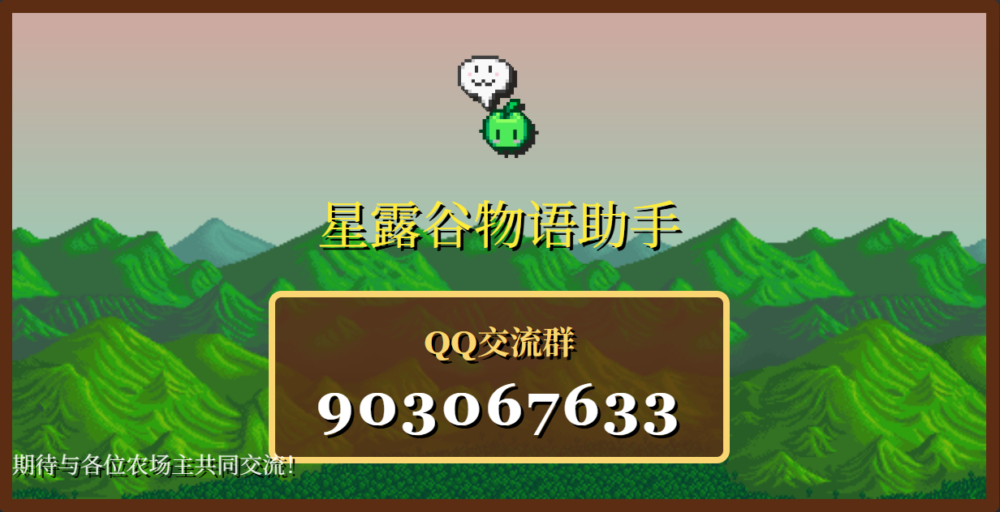

# 🌾 星露谷物语助手 (Stardew Valley Assistant)

一个基于 Tauri + React + TypeScript 构建的现代星露谷物语工具助手。旨在为农场主们提供最便捷的模组管理、存档编辑及游戏数据查询体验。

<p align="center">
  <a href="https://ayndpa.github.io/stardew-valley-assistant-pages/">
    
  </a>
  &nbsp;
  <a href="https://github.com/Ayndpa/stardew-valley-assistant-pages">
    
  </a>
</p>

> 🌐 在线宣传页：[ayndpa.github.io/stardew-valley-assistant-pages](https://ayndpa.github.io/stardew-valley-assistant-pages/) — 与本应用同源的季节主题、交互式配色预览，点击季节卡片即可切换全站配色。

## ✨ 主要功能

- 📦 **模组管理**：一键安装 SMAPI 及各类模组，轻松管理你的模组配置。
- 💾 **存档编辑**：可视化编辑你的农场存档，修改金钱、物品、技能等级等。
- 📅 **农场日历**：查看节日、村民生日及当日运势。
- 📈 **利润计算**：精准计算作物收益，助你成为最有钱的农场主。
- 🗺️ **位置查询**：实时查看村民位置，再也不用担心找不到人。

## 🤝 交流与反馈

想要参与开发或反馈建议？欢迎加入我们的 QQ 群！

<p align="center">
  <a href="https://qm.qq.com/q/baMrNVj6Za">
    
  </a>
</p>

- **QQ 交流群**：[903067633](https://qm.qq.com/q/baMrNVj6Za)
- **🌐 宣传网站**：[ayndpa.github.io/stardew-valley-assistant-pages](https://ayndpa.github.io/stardew-valley-assistant-pages/)（[源码仓库](https://github.com/Ayndpa/stardew-valley-assistant-pages)）
- **反馈建议**：请在 GitHub Issues 中提出

## 🛠️ 技术栈

- **前端**：React, TypeScript, Tailwind CSS, Lucide React
- **后端**：Rust (Tauri), Supabase
- **打包工具**：Vite

## 🚀 快速开始

### 环境准备

- [Node.js](https://nodejs.org/)
- [Rust](https://www.rust-lang.org/)
- [Tauri 开发环境](https://tauri.app/v1/guides/getting-started/prerequisites)

### 运行项目

```bash
# 安装依赖
npm install

# 启动开发服务器
npm run tauri dev
```

## 📄 开源协议

本项目采用 [MIT License](LICENSE) 协议。
